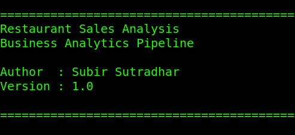
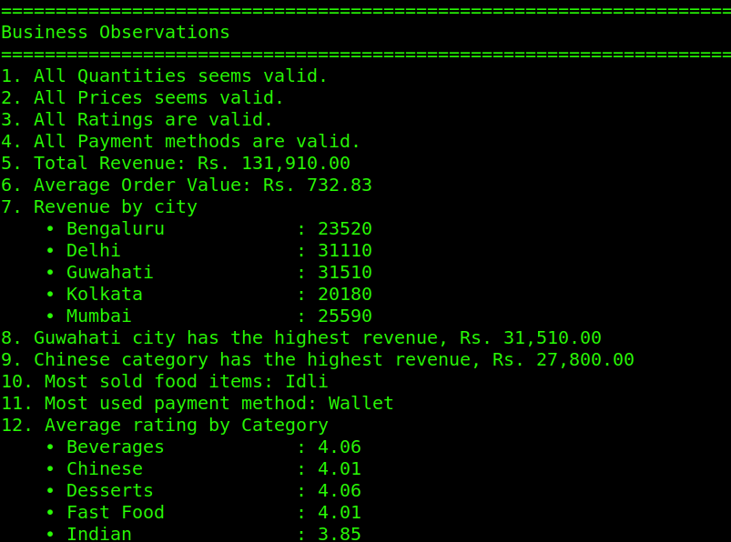
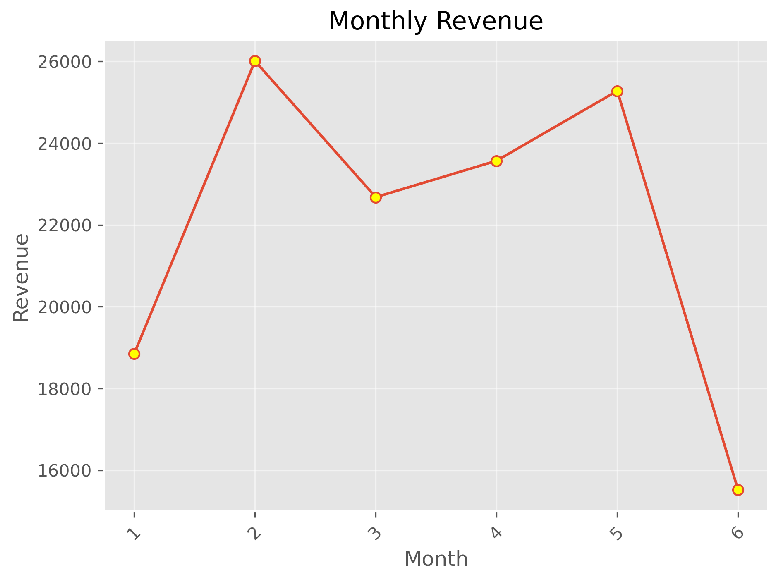
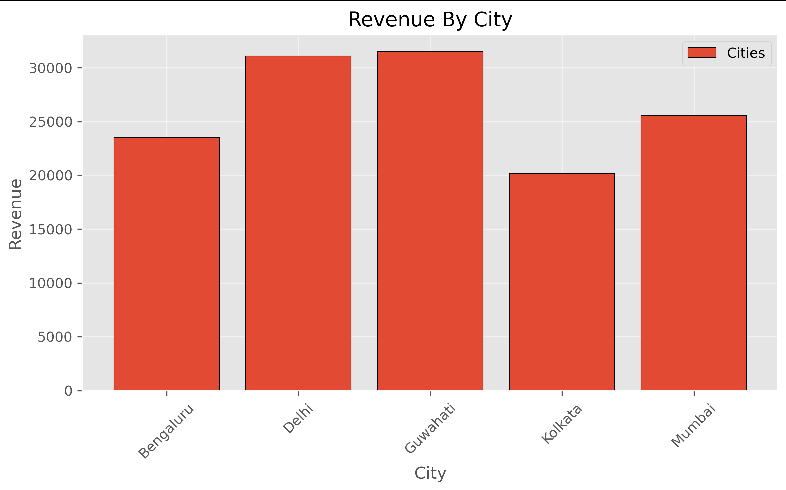
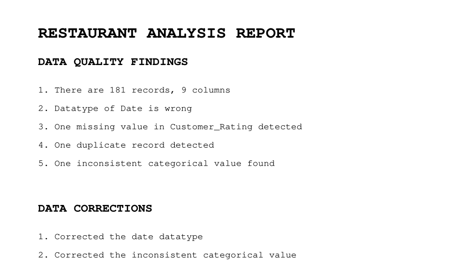

# 🍽️ Restaurant Sales Business Analytics Pipeline

A modular Business Analytics pipeline built using Python to transform raw restaurant sales data into actionable business insights through data cleaning, validation, feature engineering, investigation, visualization, and automated reporting.

---

# 🎯 Business Problem

Restaurant businesses generate hundreds of transactions every month, but raw transactional data alone cannot answer important business questions.

This project demonstrates how a Data Analyst approaches a real-world business problem by transforming raw sales data into business intelligence using a structured analytical workflow.

Rather than stopping at charts and statistics, the project investigates unusual business patterns and recommends further areas for decision making.

---

# 👤 Primary Stakeholder

**Restaurant Owner / Operations Manager**

The analysis supports operational and strategic decisions related to:

* Revenue performance
* Menu optimization
* Customer purchasing behaviour
* Payment preferences
* Business trend analysis
* Future business investigations

---

# 📌 Business Objectives

This project attempts to answer questions such as:

* Which city generates the highest revenue?
* Which food category contributes the most revenue?
* Which food items generate the highest sales?
* Which payment method is most preferred?
* What is the Average Order Value (AOV)?
* How does monthly revenue change over time?
* Which month underperformed?
* Can the observed revenue drop be explained using available business data?
* What additional investigations should management perform?

---

# 🔄 Business Analytics Pipeline

```
Raw Dataset
      │
      ▼
Data Understanding
      │
      ▼
Data Cleaning
      │
      ▼
Data Validation
      │
      ▼
Feature Engineering
      │
      ▼
Business Analysis
      │
      ▼
Business Observations
      │
      ▼
Root Cause Investigation
      │
      ▼
Recommended Investigations
      │
      ▼
Charts + PDF Report
```

---

# ✨ Project Features

* Data Quality Assessment
* Data Cleaning
* Business Rule Validation
* Feature Engineering
* Revenue Analysis
* Monthly Performance Analysis
* Average Order Value Analysis
* Customer Behaviour Analysis
* Root Cause Investigation
* Automated PDF Report Generation
* Data Visualizations
* Modular Project Architecture

---

# 🗂️ Dataset

The project analyzes restaurant transaction data containing information such as:

* Order Date
* City
* Category
* Food Item
* Quantity
* Unit Price
* Payment Method
* Customer Rating

The dataset is used purely for learning and portfolio purposes.

---

# 🏗️ Project Architecture

```
restaurant-sales-analysis/
├── CHANGELOG.md
├── LICENSE
├── README.md
├── requirements.txt
├── data
│   ├── raw
│   └── processed
├── output
│   ├── charts
│   └── reports
└── src
    ├── main.py
    ├── config.py
    ├── preprocessing.py
    ├── analysis.py
    ├── visualization.py
    └── report.py
```

The project follows a modular architecture where each module has a single responsibility.

### main.py

Application orchestrator responsible for executing the complete Business Analytics pipeline.

### preprocessing.py

Responsible for:

* Loading datasets
* Data exploration
* Data cleaning
* Data validation

### analysis.py

Responsible for:

* Feature engineering
* KPI calculations
* Business analysis
* Business observations
* Investigation logic

### visualization.py

Responsible for generating analytical charts.

### report.py

Responsible for:

* Console reporting
* PDF report generation

### config.py

Centralizes:

* File paths
* Output directories
* Visualization settings
* Global project configuration

---

# ⚙️ Setup

## Clone Repository

```bash
git clone https://github.com/subircodz/restaurant-sales-analysis.git

cd restaurant-sales-analysis
```

## Install Dependencies

```bash
pip install -r requirements.txt
```

## Run

```bash
python src/main.py
```

---

# 📊 Analysis Performed

The project performs the following analyses:

* Total Revenue
* Average Order Value (AOV)
* Revenue by City
* Revenue by Category
* Revenue by Payment Method
* Top Revenue Generating Food Items
* Highest Quantity Sold Item
* Top Rated Food Items
* Orders by Weekday
* Monthly Revenue Trend
* Monthly Average Revenue
* Monthly Average Order Value
* Monthly Average Quantity Ordered
* Average Order Value by City
* Lowest Performing Category

---

# 🔎 Investigation Performed

Instead of directly concluding why revenue declined, the project performs a structured investigation.

Example:

* Identified the lowest-performing month
* Compared business days across months
* Compared average monthly revenue
* Compared Average Order Value
* Compared average quantity ordered
* Compared city-wise revenue

If no conclusive explanation is found, the project recommends further investigation instead of making unsupported assumptions.

---

# 💼 Business Insights Generated

The current analysis identifies insights such as:

* Total Revenue
* Average Order Value
* Highest Revenue City
* Highest Revenue Category
* Highest Selling Food Item
* Most Preferred Payment Method
* Highest Rated Food Items
* Monthly Revenue Performance
* Lowest Performing Category
* Lowest Performing Month

---

# 📌 Recommended Investigations

When available data is insufficient, the project recommends additional business investigations such as:

* Category mix analysis
* Premium order analysis
* Discount and promotional campaign analysis
* Stock availability analysis
* Staffing and operational review

This demonstrates how a Data Analyst communicates uncertainty instead of drawing unsupported conclusions.

---

# 📄 Generated Outputs

The application automatically generates:

* Cleaned Dataset
* Business Charts
* Console Business Report
* Professional PDF Report

---

# 📸 Project Screenshots


### Application Execution

### Business Observations

### Monthly revenue chart

### Revenue by city chart

### Generated PDF report


---

# 🛠️ Technologies Used

* Python
* Pandas
* NumPy
* Matplotlib
* ReportLab
* Pathlib

---

# 🎓 Skills Demonstrated

* Data Cleaning
* Data Validation
* Feature Engineering
* Exploratory Data Analysis
* KPI Analysis
* Business Analytics
* Root Cause Investigation
* Business Storytelling
* Modular Python Development
* Automated Reporting
* Data Visualization

---

# 🚀 Future Improvements

* Unit Testing
* Logging Framework
* Command Line Arguments
* Interactive Dashboard
* Business Configuration Files
* Advanced Statistical Analysis
* SQL Database Integration

---

# 📚 Learning Outcome

This project demonstrates far more than data visualization.

It showcases a complete analytical workflow that mirrors how a professional Data Analyst approaches business problems:

**Understand → Clean → Validate → Engineer → Analyze → Investigate → Report → Recommend**

The emphasis is on building maintainable analytical software while communicating meaningful business insights.

---

# 📄 License

This project is licensed under the MIT License.

See the **LICENSE** file for details.

---

> **"Understand the business. Engineer the solution. Communicate the insight."**
